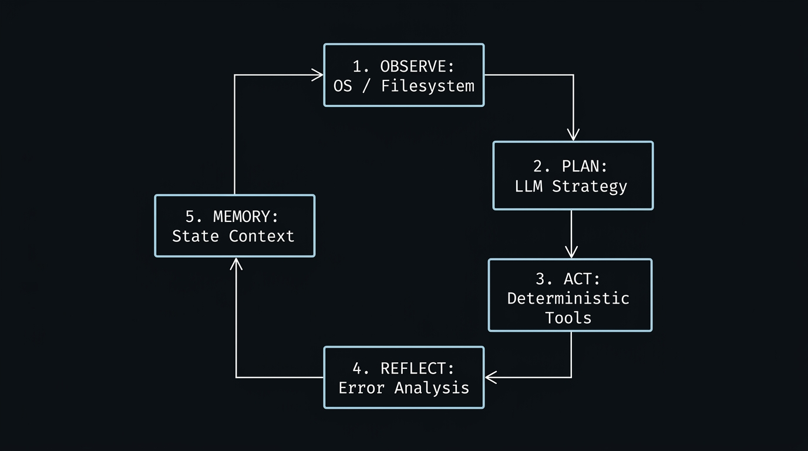

# FastAIAgent 0.1.7 — Cognitive Mind and Autonomous Coding Engine for Java

[](https://github.com/andrestubbe/FastAIAgent/releases/tag/0.1.7)
[](https://opensource.org/licenses/MIT)
[](https://www.java.com)
[]()
[](https://jitpack.io/#andrestubbe/FastAIAgent)

---

**⚡ Autonomous ReAct coding loops and cognitive planning for Java — Decoupled execution mind orchestrating file authoring, terminal commands, and self-healing.**

FastAIAgent is a **high-performance, framework-agnostic cognitive agent engine** for the JVM. It implements the formal **5-step ReAct coding loop** (`Observe → Plan → Act → Reflect → Memory`) to enable autonomous coding agents that inspect codebases, write/edit project files, run CLI tools, and correct build errors with zero framework bloat.

<p align="center">
  
</p>

---

## Quick Start — Example

```java
import fastaiagent.FastAgentKernel;
import fastairuntime.FastAIRuntime;
import fastairuntime.tools.CommandRunnerTool;
import fastairuntime.tools.FileEditTool;
import fastairuntime.tools.FileReadTool;
import fastairuntime.tools.FileSaveTool;

public class Demo {
    public static void main(String[] args) {
        // 1. Setup deterministic OS toolchain harness
        FastAIRuntime runtime = new FastAIRuntime();
        runtime.register(new FileReadTool());
        runtime.register(new FileSaveTool());
        runtime.register(new FileEditTool());
        runtime.register(new CommandRunnerTool());

        // 2. Initialize Autonomous Coding Kernel
        FastAgentKernel kernel = new FastAgentKernel(runtime,
            () -> runtime.execute(new fastairuntime.FastCommand("file.read", java.util.Map.of("path", "src/Main.java"))),
            (goal, obs, plan) -> /* AI / LLM reasoning planner */,
            (plan, result) -> result.success() ? "OK" : "Error: " + result.message()
        );

        // 3. Execute goal-driven ReAct loop
        kernel.loop("Create, compile, and fix Calculator.java", 10);
    }
}
```

---

## Table of Contents

- [Why FastAIAgent?](#why-fastaiagent)
- [Key Features](#key-features)
- [Real-World Use Cases](#real-world-use-cases)
- [Architecture Overview](#architecture-overview)
- [API Quick Reference](#api-quick-reference)
- [Examples & Demos](#examples--demos)
- [Installation](#installation)
- [Documentation](#documentation)
- [Platform Support](#platform-support)
- [License](#license)
- [Related Projects](#related-projects)

---

## Why FastAIAgent?

Traditional agent frameworks in Python (`LangChain`, `CrewAI`, `AutoGen`) and Java (`LangChain4j`) are bloated, slow, and impose heavy framework locks. `FastAIAgent` delivers:

- **Autonomous Coding Agent Loop** — Self-directed file inspection, precise line editing (`file.edit`), shell execution, and compile verification.
- **Strict Mind-Body Separation** — Thought & planning (`FastAIAgent`) is completely decoupled from deterministic OS execution (`FastAIRuntime`).
- **Single Source of Truth** — Full plan rewriting prevents drift across multi-step execution turns.
- **Zero Framework Bloat** — Pure Java 17+ with sub-millisecond execution overhead and minimal dependencies.

---

## Key Features

- **💻 Autonomous Code Authoring & Patching** — Create, inspect, patch (`file.edit`), and compile Java source files.
- **🧠 5-Stage Cognitive Loop** — Native state machine for `Observe → Plan → Act → Reflect → Memory`.
- **📡 FastAIEventBus Observability** — Real-time event subscription for step logs, token traces, and tool telemetry.
- **⚡ Deterministic OS Execution** — Direct file, keyboard, mouse, process, and CLI management via `FastAIRuntime`.
- **💾 Stateful Conversation Memory** — Native integration with `FastAIMemory` and `FastAIBot`.

---

## Real-World Use Cases

- **🛠️ Self-Healing CI/CD Pipelines** — Automatically parses compiler error logs and test failure stack traces, locates the offending source files, and applies targeted patches (`file.edit`) to restore green builds.
- **🔄 Autonomous Codebase Refactoring** — Scans repository structure via `FastAIRuntime`, upgrades deprecated API calls, and normalizes formatting across hundreds of Java classes without developer intervention.
- **🧪 Test Suite Generation & Verification** — Observes existing production classes, generates corresponding JUnit test suites (`file.save`), and executes `mvn test` in a loop until full coverage is verified.
- **🖥️ Desktop & OS-Level Automation** — Orchestrates multi-step developer setup flows by combining shell commands with native UI interactions (UIA / Notepad / System tools).

---

## Architecture Overview

**[FastAIAgent](https://github.com/andrestubbe/FastAIAgent) (The Mind)**  
Orchestrates the cognitive ReAct loop, task planning, and reflection over results.

**[FastAIRuntime](https://github.com/andrestubbe/FastAIRuntime) (The Body & Harness)**  
Provides deterministic OS-level tool execution (`file.read`, `file.save`, `file.edit`, `cmd.run`, UIA, keyboard, mouse) and security gates.

**[FastAIMemory](https://github.com/andrestubbe/FastAIMemory) (The Memory)**  
Maintains structured conversation history, context windows, and episodic state.

**[FastAI](https://github.com/andrestubbe/FastAI) (The LLM Client)**  
Powers streaming model inference with local and cloud models.

---

## API Quick Reference

| Class / Method | Return Type | Description |
|---|---|---|
| `FastAgentKernel(runtime, obs, planner, reflector)` | `FastAgentKernel` | Constructs the 5-step ReAct coding agent kernel. |
| `kernel.loop(goal, maxCycles)` | `void` | Executes the Observe-Plan-Act-Reflect cycle until the goal is met. |
| `FastAIEventBus.getInstance()` | `FastAIEventBus` | Accesses the global agent event dispatcher for observability. |
| `FastAIPromptBuilder.buildSystemPrompt(runtime)` | `String` | Generates a tool-definition system prompt from registered tools. |
| `FastAIAgent(bot, runtime, logger)` | `FastAIAgent` | Standard conversational agent with tool-call parsing and execution. |

---

## Examples & Demos

`FastAIAgent` provides 36+ runnable standalone demos in `examples/Demo/`:

| Script | Class | Demonstrates |
|---|---|---|
| `run-35-reasoner-guided-coding-demo.bat` | `ReasonerGuidedCodingDemo` | **Tree-of-Thoughts Guided Coding**: Multi-branch architectural exploration via `FastAIReasoner` |
| `run-36-self-healing-reflection-demo.bat` | `SelfHealingReflectionDemo` | **Chain-of-Thought Self-Healing**: Compiler diagnosis & automated patch repair |
| `run-34-coding-agent-loop-demo.bat` | `CodingAgentLoopDemo` | **Autonomous Coding Agent**: File creation, inspection, refactoring (`file.edit`) |
| `run-34a-observe-sub-demo.bat` | `CodingObserveSubDemo` | Phase 1: Environment & Workspace Observation |
| `run-34b-plan-act-sub-demo.bat` | `CodingPlanActSubDemo` | Phase 2 & 3: Plan Formulation & Deterministic Execution |
| `run-34c-reflect-sub-demo.bat` | `CodingReflectSubDemo` | Phase 4: Self-Reflection & Error Recovery |
| `run-01-planning-agent-demo.bat` | `PlanningAgentDemo` | Multi-step planning and Notepad execution |
| `run-05-file-manipulation-agent-demo.bat` | `FileManipulationAgentDemo` | File system operations |
| `run-16-multi-agent-orchestrator-demo.bat` | `MultiAgentOrchestratorDemo` | Multi-agent coordination |

---

## Installation

### Option 1: Maven (Recommended)

Add the JitPack repository and the dependencies to your `pom.xml`:

```xml
<repositories>
    <repository>
        <id>jitpack.io</id>
        <url>https://jitpack.io</url>
    </repository>
</repositories>

<dependencies>
    <dependency>
        <groupId>com.github.andrestubbe</groupId>
        <artifactId>FastAIAgent</artifactId>
        <version>0.1.5</version>
    </dependency>
    <dependency>
        <groupId>com.github.andrestubbe</groupId>
        <artifactId>FastAIRuntime</artifactId>
        <version>0.1.0</version>
    </dependency>
    <dependency>
        <groupId>com.github.andrestubbe</groupId>
        <artifactId>FastAIMemory</artifactId>
        <version>0.1.3</version>
    </dependency>
    <dependency>
        <groupId>com.github.andrestubbe</groupId>
        <artifactId>fastai</artifactId>
        <version>0.1.4</version>
    </dependency>
    <!-- Required for native library loading -->
    <dependency>
        <groupId>com.github.andrestubbe</groupId>
        <artifactId>FastCore</artifactId>
        <version>0.1.0</version>
    </dependency>
</dependencies>
```

### Option 2: Gradle (via JitPack)

```groovy
repositories {
    maven { url 'https://jitpack.io' }
}

dependencies {
    implementation 'com.github.andrestubbe:FastAIAgent:0.1.5'
    implementation 'com.github.andrestubbe:FastAIRuntime:0.1.0'
    implementation 'com.github.andrestubbe:FastAIMemory:0.1.3'
    implementation 'com.github.andrestubbe:fastai:0.1.4'
    // Required for native library loading
    implementation 'com.github.andrestubbe:FastCore:0.1.0'
}
```

### Option 3: Direct Download (No Build Tool)

Download the latest JARs directly to add them to your classpath:

1. 🧠 **[FastAIAgent-0.1.5.jar](https://github.com/andrestubbe/FastAIAgent/releases/download/0.1.5/FastAIAgent-0.1.5.jar)** (Cognitive Engine)
2. ⚙️ **[FastAIRuntime-0.1.0.jar](https://github.com/andrestubbe/FastAIRuntime/releases/download/0.1.0/FastAIRuntime-0.1.0.jar)** (Execution Harness)
3. 💾 **[FastAIMemory-0.1.3.jar](https://github.com/andrestubbe/FastAIMemory/releases/download/0.1.3/FastAIMemory-0.1.3.jar)** (Conversation Memory)
4. 🤖 **[fastai-0.1.4.jar](https://github.com/andrestubbe/FastAI/releases/download/0.1.4/fastai-0.1.4.jar)** (Unified AI Client)
5. ⚙️ **[fastcore-0.1.0.jar](https://github.com/andrestubbe/FastCore/releases/download/0.1.0/fastcore-0.1.0.jar)** (Required Native JNI Loader)

> [!IMPORTANT]
> All JARs must be included in your classpath for the agent runtime and memory layers to function correctly.

---

## Documentation

* **[REFERENCE.md](docs/REFERENCE.md)**: Core API reference manual.
* **[PHILOSOPHY.md](docs/PHILOSOPHY.md)**: ReAct coding loop and decoupled architecture design.
* **[COMPILE.md](docs/COMPILE.md)**: Maven build instructions.
* **[CHANGELOG.md](docs/CHANGELOG.md)**: Project history.
* **[ROADMAP.md](docs/ROADMAP.md)**: Future development goals.

---

## Platform Support

| Platform | Status |
|---|---|
| Windows 10/11 (x64) | ✅ Fully Supported |
| Linux | 🚧 Planned |
| macOS | 🚧 Planned |

---

## License

MIT License — See [LICENSE](LICENSE) file for details.

---

## Related Projects

- [FastAI](https://github.com/andrestubbe/FastAI) — Unified AI client interface for Java
- [FastAIAgent](https://github.com/andrestubbe/FastAIAgent) — Autonomous agent loop, intent-graphs, and tool execution
- [FastAIBot](https://github.com/andrestubbe/FastAIBot) — Zero-bloat bot harnesses and persona runtime
- [FastAIGraph](https://github.com/andrestubbe/FastAIGraph) — In-memory knowledge graph and multi-hop relationship engine
- [FastAIHybrid](https://github.com/andrestubbe/FastAIHybrid) — Dense-sparse hybrid search fusion (BM25 + Vectors)
- [FastAIMatcher](https://github.com/andrestubbe/FastAIMatcher) — Automated SOX compliance and hybrid rule matching engine
- [FastAIMCP](https://github.com/andrestubbe/FastAIMCP) — Model Context Protocol (MCP) server & tool integration
- [FastAIMemory](https://github.com/andrestubbe/FastAIMemory) — Conversation history, sliding windows, and rolling summaries
- [FastAIMetrics](https://github.com/andrestubbe/FastAIMetrics) — Ultra-fast lock-free token, latency, cost tracking and evaluation engine
- [FastAIModel](https://github.com/andrestubbe/FastAIModel) — Native local inference runtime (GGUF/ONNX)
- [FastAIRag](https://github.com/andrestubbe/FastAIRag) — Ultra-fast document chunking and vector retrieval
- [FastAIReasoner](https://github.com/andrestubbe/FastAIReasoner) — Deterministic planning, chain-of-thought, and self-correction
- [FastAIRerank](https://github.com/andrestubbe/FastAIRerank) — Cross-encoder relevance filtering and Top-N prompt pruner
- [FastAIRuntime](https://github.com/andrestubbe/FastAIRuntime) — Sandboxed process runner and tool-calling execution pipeline
- [FastAIState](https://github.com/andrestubbe/FastAIState) — Lock-free shared agent state & blackboard memory
- [FastAIVectorDB](https://github.com/andrestubbe/FastAIVectorDB) — High-throughput SIMD/AVX2 vector database
- [FastAIVision](https://github.com/andrestubbe/FastAIVision) — High-speed local multimodal vision, UI-element grounding, and screen-VLM engine
- [FastCore](https://github.com/andrestubbe/FastCore) — Unified JNI loader and platform abstraction

---

**Part of the FastJava Ecosystem** — *Making the JVM faster. Small package. Maximum speed. Zero bloat. 🚀📋*