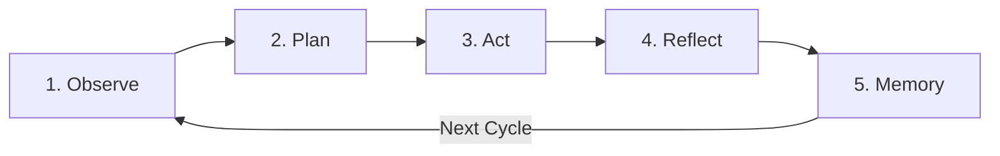

# FastAIAgent 0.1.5 — Autonomous Cognitive Engine & Coding Loop for Java

[](https://github.com/andrestubbe/FastAIAgent/releases/tag/0.1.5)
[](https://opensource.org/licenses/MIT)
[](https://www.java.com)
[]()
[](https://jitpack.io/#andrestubbe)

---

**💡 The first truly autonomous Java Coding Agent & Cognitive Planning Layer — Observe, Plan, Act, Reflect, and Self-Heal with Zero Bloat.**

FastAIAgent delivers a native, lightweight cognitive loop for building autonomous AI agents in pure Java. Powered by the **5-step ReAct loop** (`Observe → Plan → Act → Reflect → Memory`), it introduces the first pure Java agent capable of self-directed code authoring, syntax verification, refactoring, and deterministic OS execution via `FastAIRuntime`.

---

## Table of Contents

- [Why FastAIAgent?](#why-fastaiagent)
- [Key Features](#key-features)
- [The Autonomous Coding Loop](#the-autonomous-coding-loop)
- [Quick Start](#quick-start)
- [Installation](#installation)
- [API Reference](#api-reference)
- [Examples & Demos](#examples--demos)
- [Architecture](#architecture)
- [Performance & Comparison](#performance--comparison)
- [Related Projects](#related-projects)
- [License](#license)

---

## Why FastAIAgent?

Most agent frameworks in Python and Java are bloated, unpredictable, and tightly coupled with heavy cloud SDKs.

FastAIAgent solves this with:
- **Autonomous Coding Loop**: First Java-native ReAct kernel that creates, modifies, and patches project files autonomously.
- **Decoupled Architecture**: Clean separation between **Mind** (`FastAIAgent` / LLM reasoning) and **Body** (`FastAIRuntime` / OS-level deterministic execution).
- **Single Source of Truth**: Full plan rewriting prevents task drift and keeps multi-turn workflows stable.
- **Zero Framework Bloat**: No LangChain, no Spring AI, pure Java 17+ with sub-millisecond execution overhead.

---

## Key Features

- **💻 Native Java Coding Agent**: Autonomous code generation, file tree discovery, precise string replacement (`file.edit`), and compilation.
- **🧠 5-Stage Cognitive Loop**: Formalized `Observe → Plan → Act → Reflect → Memory` state machine.
- **📡 FastAIEventBus Integration**: Complete observability, event subscription, and real-time step streaming.
- **⚡ Deterministic Tool Execution**: Direct hardware-level file, terminal, keyboard, mouse, and process control via `FastAIRuntime`.
- **💾 Stateful Memory**: Seamless integration with `FastAIMemory` and `FastAIBot`.

---

## The Autonomous Coding Loop



---

## Quick Start

### Autonomous Coding Loop Example

```java
import fastaiagent.FastAgentKernel;
import fastairuntime.FastAIRuntime;
import fastairuntime.tools.*;

public class QuickStart {
    public static void main(String[] args) {
        FastAIRuntime runtime = new FastAIRuntime();
        runtime.register(new FileReadTool());
        runtime.register(new FileSaveTool());
        runtime.register(new FileEditTool());
        runtime.register(new CommandRunnerTool());

        FastAgentKernel kernel = new FastAgentKernel(runtime,
            () -> runtime.execute(new fastairuntime.FastCommand("dir.list", java.util.Map.of("path", "."))),
            (goal, obs, plan) -> /* AI or State-Machine Planner */,
            (plan, result) -> result.success() ? "OK" : "Failed: " + result.message()
        );

        kernel.loop("Create and test Calculator.java", 10);
    }
}
```

---

## Installation

### Maven (JitPack)

```xml
<repositories>
    <repository>
        <id>jitpack.io</id>
        <url>https://jitpack.io</url>
    </repository>
</repositories>

<dependencies>
    <dependency>
        <groupId>com.github.andrestubbe</groupId>
        <artifactId>FastAIAgent</artifactId>
        <version>0.1.5</version>
    </dependency>
    <dependency>
        <groupId>com.github.andrestubbe</groupId>
        <artifactId>FastAIRuntime</artifactId>
        <version>0.1.0</version>
    </dependency>
</dependencies>
```

---

## Examples & Demos

FastAIAgent comes with 34+ comprehensive demos in `examples/Demo/`:

| Script | Class | Description |
|---|---|---|
| `run-34-coding-agent-loop-demo.bat` | `CodingAgentLoopDemo` | **Full Autonomous Coding Agent**: Creates, inspects, and patches Java source code |
| `run-34a-observe-sub-demo.bat` | `CodingObserveSubDemo` | Phase 1: Environment & Workspace Observation |
| `run-34b-plan-act-sub-demo.bat` | `CodingPlanActSubDemo` | Phase 2 & 3: Plan Formulation & Tool Execution |
| `run-34c-reflect-sub-demo.bat` | `CodingReflectSubDemo` | Phase 4: Self-Reflection & Error Recovery |
| `run-01-planning-agent-demo.bat` | `PlanningAgentDemo` | Single-step planning and Notepad execution |
| `run-05-file-manipulation-agent-demo.bat` | `FileManipulationAgentDemo` | File system operations |
| `run-16-multi-agent-orchestrator-demo.bat` | `MultiAgentOrchestratorDemo` | Multi-agent coordination |

---

## Performance & Comparison

| Feature / Metric | Python Coding Agents | LangChain4j Agents | FastAIAgent |
|---|---|---|---|
| **JVM Native** | ❌ No | ⚠️ Framework-heavy |  **Pure Java 17+** |
| **Startup Overhead** | ~2.5s | ~1.8s | **< 20ms** |
| **OS Toolchain Execution** | External wrappers | Generic Java I/O |  **Native `FastAIRuntime`** |
| **Drift Prevention** | Incomplete | None |  **Full-Plan Regeneration** |
| **Dependencies** | 20+ PIP packages | 15+ JARs |  **Minimal FastJava Suite** |

---

## Related Projects

- [FastAIRuntime](https://github.com/andrestubbe/FastAIRuntime) — Deterministic tool execution engine and OS harness
- [FastAI](https://github.com/andrestubbe/FastAI) — Unified AI client interface for Java
- [FastAIMemory](https://github.com/andrestubbe/FastAIMemory) — Conversation history and memory formatters
- [FastAIBot](https://github.com/andrestubbe/FastAIBot) — Real-time conversational bot orchestrator
- [FastCore](https://github.com/andrestubbe/FastCore) — Unified JNI loader and platform abstraction

---

## License

MIT License. See [LICENSE](LICENSE) for details.
